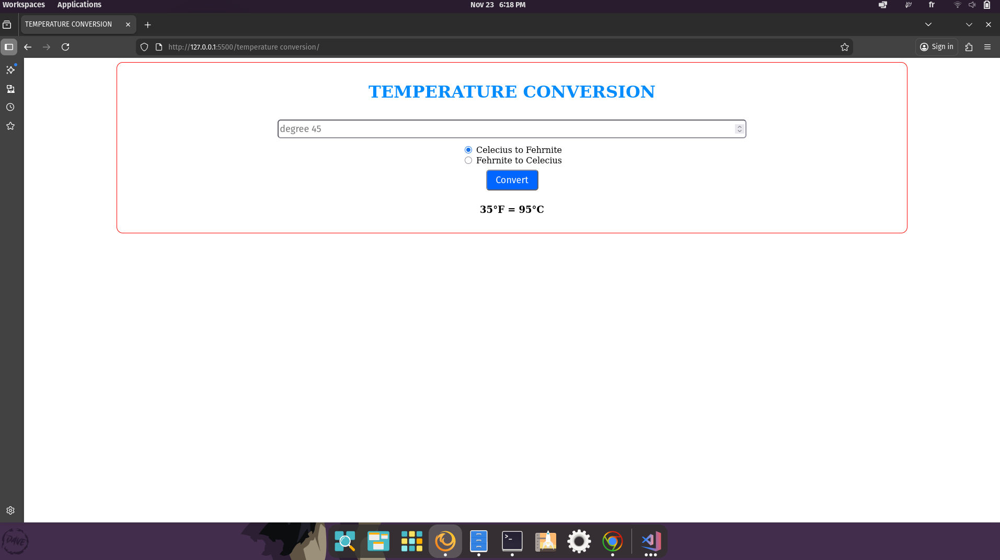

# Temperature Conversion

Welcome to **Temperature Conversion** — a simple utility to convert between Celsius and Fahrenheit.

## 🚀 Project Overview
This small demo lets users convert temperatures between Celsius and Fahrenheit using straightforward formulas and a simple interface.

## 🌟 Features
- Convert Celsius to Fahrenheit and vice versa
- Clear error messages and UI feedback

## 🛠️ Technologies Used
- HTML, CSS, JavaScript

## 📦 Project Structure
```
index.html
main.js
style.css
```

## 📸 Screenshots


## ✨ How to Use
1. Open `index.html` in your browser.
2. Enter a temperature, select a conversion direction, and click 'Convert'.

## Notes & Suggestions
- Ensure labeling is clear to avoid confusion (C↔F labels).

## 👤 Author
**ISSAM SENSI**

---
© 2025 [issamsensi](https://github.com/issamsensi)
